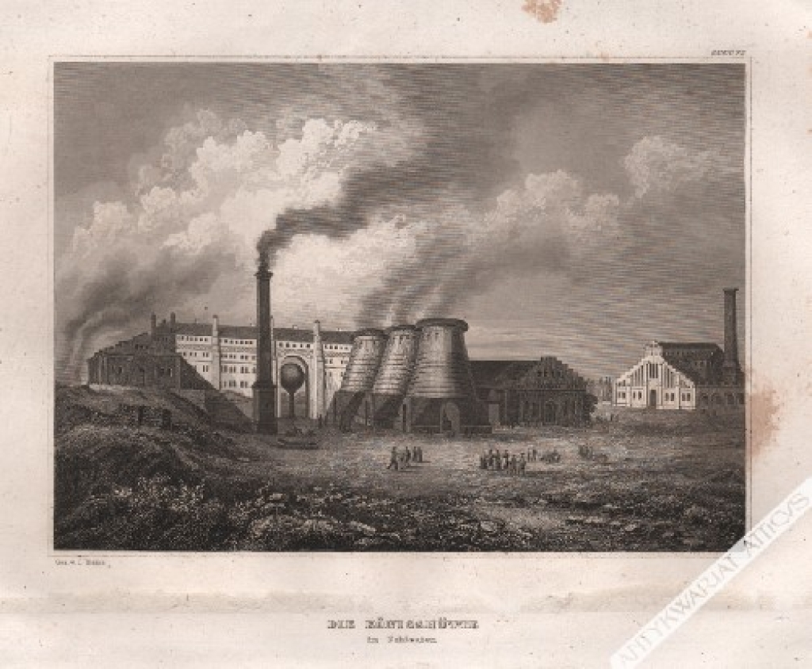
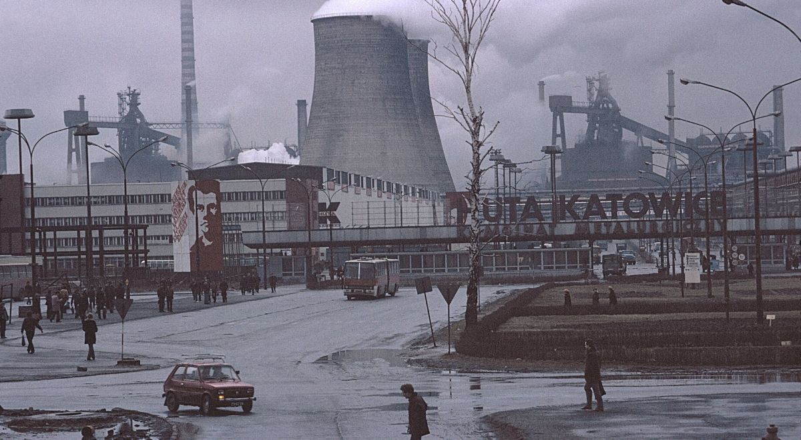
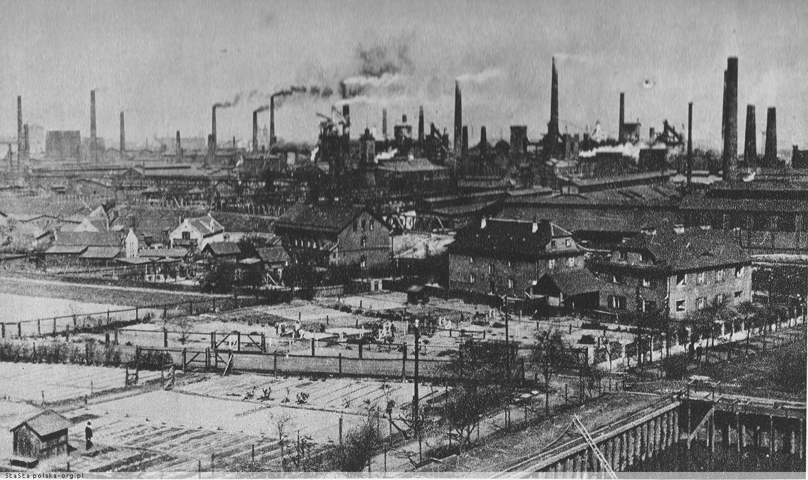

# **Rajdeł po hutach na Ślunsku/Zagłębiu śladami Furii**

---

### Referencja główna: [najlepsiejsze muzyczki](https://www.youtube.com/watch?v=H89ybguQPFs) 

---

| Huta      | Miasto | Zdjątko     |
| :---        |    :----:   |          ---: |
| [Huta Laura](https://pl.wikipedia.org/wiki/Huta_Laura_(Siemianowice_Śląskie))     | Siemianowice Ślunskie       |    |
| [Huta Katowice](https://pl.wikipedia.org/wiki/Huta_Katowice)   | Dąbrowa Górnicza        |       |
| [Królewska Huta](https://mojchorzow.pl/p,s,historia_dzielnicy_centrum_krolewska_huta.html)   | Chorzów        |     |

---

## *NOTATNIK KARI*

Trochę to mało po drodze by było, ale to ~~szczgólik malutki~~ XD 

W sensie yup, Siemce wiadomo, Chorzów też jest bliziutko, natomiast większy problem jest z Dąbrową moją ukochaną :heart: 

Jeśli mnie zapytasz, czy w ogóle ten jeden utworek jest serio o Hucie Katowice, o idk, ale <mark>zakładam to z góry</mark> XD

Czy zrobiłam to w sumie po to, bo po pierwsze to fajen pomysł, a po drugie, że zatęskniłam za Markdownem?

- [ ] TAK
- [X] ***TAKŻE TAK, ALE POGRUBIONE***
